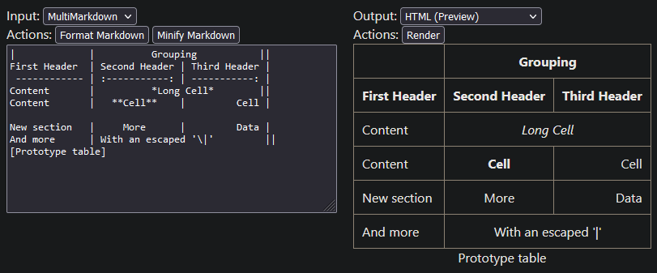

# MultiMarkdown table tools

> ⚠️ Work-In-Progress

This module currently has the following features:

- Parsing MultiMarkdown, HTML, or CSV tables
- Converting tables to MultiMarkdown, HTML, or CSV
- Formatting or minifying MultiMarkdown tables
- Manipulating parsed tables, e.g.
  - by adding or removing rows
  - by adding or removing columns
  - by changing the content of table cells
  - by merging table cells
  - ...

More to come.



## Syntax

This module mostly follows the MultiMarkdown specs: https://fletcher.github.io/MultiMarkdown-6/syntax/tables.html

With one exception: You can merge cells vertically by writing `^^` into a cell.

### Differences to tables in GitHub-flavored Markdown (and similar variants)

GitHub-flavored Markdown tables (and similar variants) are fully supported, with these additional features:

- You can merge cells horizontally by adding additional pipes (`|`) at the end of the cell.
- You can merge cells vertically by writing `^^` into a cell;
- You can add a caption above or below to the table. Captions can optionally have labels.
- You can have a header with multiple rows.
- You can omit the header.
- You can divide the table into multiple sections by adding a single empty line in-between rows.

## Building

```
$ git clone https://github.com/FelisDiligens/md-table-tools.git
$ cd md-table-tools
$ npm install
$ npm run build
```

## Usage

Build the project and open `./dist/index.html` for a demo.