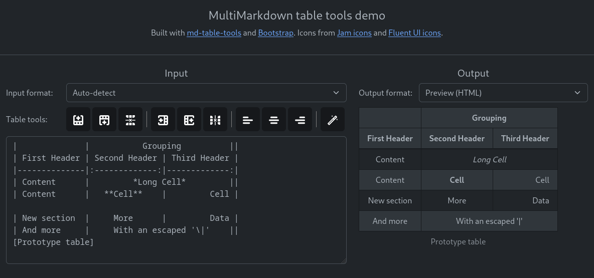

> **Warning**  
> Work in progress. API may change in the future, bugs may rear their ugly head...  
> Use with care! If in doubt, ask me. :)

# MultiMarkdown table tools

[](https://www.npmjs.com/package/@felisdiligens/md-table-tools)



> Screenshot of [web demo](https://felisdiligens.github.io/md-table-tools/demo/)

## Features

- Parsing MultiMarkdown, GitHub-flavored Markdown, HTML, or CSV tables into intermediary
- Converting intermediary back to MultiMarkdown, GitHub-flavored Markdown, HTML, or CSV tables
- Formatting or minifying MultiMarkdown or GFM tables
- Manipulating parsed/intermediary tables (⚠️ *possibly buggy, please run `Table.update()` after making any changes*), e.g.
  - by adding, deleting, or moving rows/columns
  - by changing the content of table cells
  - by merging or splitting table cells
  - by changing the text alignment within a column
  - etc.

## Module

This project gets packaged as CommonJS and ES module. Types are generated as well.

To install, run
```bash
npm i @felisdiligens/md-table-tools
```

## Usage / Examples

### Web demo

A web demo (see screenshot above) can be accessed [here](https://felisdiligens.github.io/md-table-tools/demo/).

The source code is under `./demo`.

### CLI demo

```bash
$ npm run demo
```

```typescript
import { MultiMarkdownTableParser } from "@felisdiligens/md-table-tools";
import { HTMLTableRenderer } from "@felisdiligens/md-table-tools";

const mdParser = new MultiMarkdownTableParser();
const htmlRenderer = new HTMLTableRenderer();

var mdTable = `
| Example | table  |
|---------|--------|
| Hello   | world! |
`;

// Parse markdown to intermediary:
var intermediaryTable = mdParser.parse(mdTable);

// Make some changes:
intermediaryTable.getCell(1, 1).setText("everyone!");
intermediaryTable.update();

// Render as HTML:
var htmlTable = htmlRenderer.render(intermediaryTable);

/* Output:
<table>
  <thead>
    <tr>
      <th>Example</th>
      <th>table</th>
    </tr>
  </thead>
  <tbody>
    <tr>
      <td>Hello</td>
      <td>everyone!</td>       <--- Changed!
    </tr>
  </tbody>
</table>
*/
```

### Projects

See [my Joplin plugin](https://github.com/FelisDiligens/joplin-plugin-multimd-table-tools) as an example for usage.

## Docs

You can access the documentation here: [./docs/modules.md](/docs/modules.md).  
Or click on one of the classes below:

- All classes implementing the interface [`TableRenderer`](/docs/interfaces/TableRenderer.md):  
  You can always use the `TableRenderer.render(Table)` method to get a rendered string.
  - [`PrettyMultiMarkdownTableRenderer`](/docs/classes/PrettyMultiMarkdownTableRenderer.md)
  - [`MinifiedMultiMarkdownTableRenderer`](/docs/classes/MinifiedMultiMarkdownTableRenderer.md)
  - [`GitHubFlavoredMarkdownTableRenderer`](/docs/classes/GitHubFlavoredMarkdownTableRenderer.md)
  - [`HTMLTableRenderer`](/docs/classes/HTMLTableRenderer.md)
  - [`CSVTableRenderer`](/docs/classes/CSVTableRenderer.md)
- All classes implementing the interface [`TableParser`](/docs/interfaces/TableParser.md):  
  You can always use the `TableParser.parse(string)` method to get an intermediary `Table` object.
  - [`MultiMarkdownTableParser`](/docs/classes/MultiMarkdownTableParser.md)
  - [`GitHubFlavoredMarkdownTableParser`](/docs/classes/GitHubFlavoredMarkdownTableParser.md)
  - [`HTMLTableParser`](/docs/classes/HTMLTableParser.md)
  - [`CSVTableParser`](/docs/classes/CSVTableParser.md)
- Intermediary classes:  
  You can access rows, columns, cells, and the caption from the `Table` parent class.  
  Use these to manipulate the table. Don't forget to run `Table.update()` method afterwards!
  - [`Table`](/docs/classes/Table.md)
  - [`TableRow`](/docs/classes/TableRow.md)
  - [`TableColumn`](/docs/classes/TableColumn.md)
  - [`TableCell`](/docs/classes/TableCell.md)
  - [`TableCaption`](/docs/classes/TableCaption.md)
- Enums:
  - [`TextAlignment`](/docs/enums/TextAlignment.md)
  - [`TableCellMerge`](/docs/enums/TableCellMerge.md)
  - [`TableCaptionPosition`](/docs/enums/TableCaptionPosition.md)
  - [`HTMLTableParserMode`](/docs/enums/HTMLTableParserMode.md)
  - [`CSVTableRendererMode`](/docs/enums/CSVTableRendererMode.md)

## Development

### Building

```bash
$ git clone https://github.com/FelisDiligens/md-table-tools.git
$ cd md-table-tools
$ npm install
$ npm run build
```

### Testing

```bash
$ npm run test
```

## MultiMarkdown Syntax

This module mostly follows the MultiMarkdown specs: https://fletcher.github.io/MultiMarkdown-6/syntax/tables.html

With a few exceptions:
- You can merge cells vertically by writing `^^` into a cell.
- You can use `\` to join rows together.

### Differences to tables in GitHub-flavored Markdown (and similar variants)

GitHub-flavored Markdown tables (and similar variants) are fully supported, with these additional features:

- You can merge cells horizontally by adding additional pipes (`|`) at the end of the cell.
- You can merge cells vertically by writing `^^` into a cell.
- You can merge the row below by writing `\` at the end of a row.
- You can add a caption above or below to the table. Captions can optionally have labels.
- You can have a header with multiple rows.
- You can omit the header.
- You can divide the table into multiple sections by adding a single empty line in-between rows.

## Built with...

- written in [TypeScript](https://www.typescriptlang.org/)
- [Cheerio](https://github.com/cheeriojs/cheerio#readme) and [htmlparser2](https://github.com/fb55/htmlparser2#readme) - for parsing HTML
- [Turndown](https://mixmark-io.github.io/turndown/) - for inline HTML to Markdown conversion
- [Rollup](https://rollupjs.org/) - for bundling
- [Mocha](https://mochajs.org/) and [Chai](https://www.chaijs.com/) - for testing